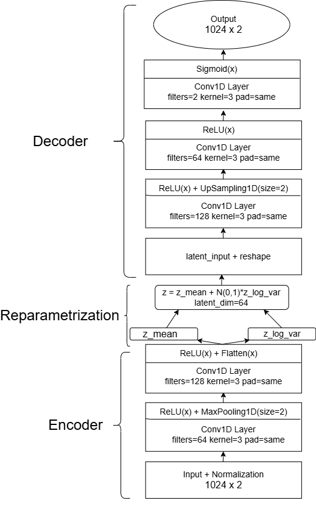

# Практическая часть курсовой работы Разработка архитектуры нейронной сети для восстановления радиосигнала
Включает 2 подчасти: 
- применение классических методов восстановления сигнала к практическим задачам;
- реализация VAE для решения задачи восстановления радиосигнала с БПЛА на датасете `RadioML 2018`.
Вся реализация происходит на языке `Python` с использованием библиотек и сторонних модулей:
`matplotlib`, `scipy`, `statsmodels`, `sklearn`, `transformers`.
## Part 1
Теоретическая часть о классических методах восстановления сигнала, включает разбор:
- преобразование Фурье;
- вейвлет-преобразование;
- фильтры обработки сигнала: фильтр Калмана, Буттерворта и Чебышева.
## Part 2
Разобранные в первой главе классические методы восстановления радиосигнала демонстрируются на практике:
- dft_practice
Восстановление зашумленного сигнала с помощью применения ДПФ.
- kalman_practice
Оценка истинного радиосигнала с помощью фильтра Калмана на основе зашумленных наблюдений.
- wavelet_practice
Восстановление радиосигнала с потерянными данными с помощью вейвлет-преобразования.

## Part 3
Реализован вариационный автоэнкодер, состоящий из двух `Conv1D` и `MaxPooling1D`. Метриками качества выступали `MSE`, `MAE` и `PSNR`.
Полная архитектура VAE приведена ниже: 

Лучшее качество было достигнуто путем увеличения `latent_dim` до 64 и нормализации входных данных в диапазоне [0;1].
Чтобы доказать, что для восстановления сигнала из датасета `RadioML 2018` лучше подходит использование реализованной архитектуры VAE, было также реализовано восстановление радиосигнала с помощью фильтра Калмана, который справился с задачей значительно хуже

## Выводы
- 
